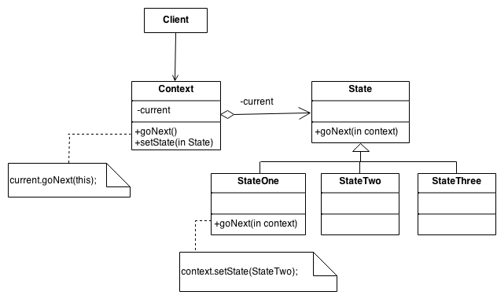
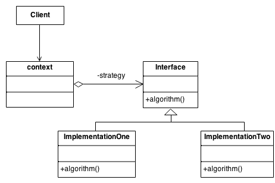

# Design patterns

## Creational Patterns

## Structural Patterns

## Behavioral Patterns

### State

An object alters its behavior when its internal state changes.

- there are a finite number of states which a program can be in
- for each one the program behaves differently
- can change from one to another easily by some predefined and finite rules (transitions)
- any change to the transition logic may require changing state conditions in every method

- create new types for each possible state and extract all state-specific behavior in them
- transition by replacing the current active state with the new state
- create new states or change existing one independently of each other

- used when
  - needing to organize code and decrease complexity ([Single Responsibility Principle](../principles/solid/readme.md))
  - there are a lot of states and want to add new states independently of existing ones ([Open / Closed Principle](../principles/solid/readme.md))

[Code here](./blob/main/patterns/behavioralpatterns/state/vendingMachine_test.go).

### Strategy

For designing a family of interchangeable algorithms hidden behind an abstraction.

- strategy
  - interface defining the work
  - one method that triggers the algorithm for the strategy implementation

- context 
  - contains a reference to the chosen strategy implementation
  - it delegates the work to a linked strategy
  - the client passes to the context the chosen strategy
  - the context is independent of the concrete strategy

- used when
  - using variations of an algorithm
  - you can alter the context's behavior at runtime and associate a different strategy to it
  - respects [Open / Closed Principle](../principles/solid/readme.md) - introduce different strategies or policies without changing the context

[Code here](./blob/main/patterns/behavioralpatterns/strategy/context_test.go).

Example: [AoC 2022, day 11](https://adventofcode.com/2022/day/11) (the operation done by each monkey)